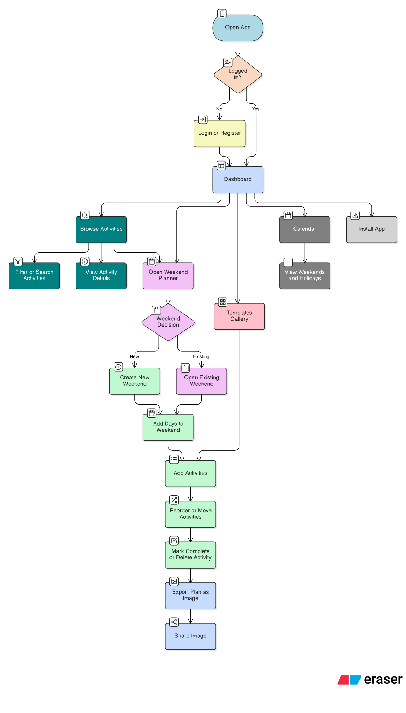

# SatSun (Weekendly) ✨


## 📖 Project Overview

SatSun(Weekendly) is a lightweight planner to turn free weekends into simple, shareable schedules.
Browse an activity library (or templates), add items to any number of days, and reorder or move them with ease.
It’s fast and offline‑friendly thanks to cache‑first reads and a PWA app shell, with one‑click PNG export for sharing.
Secure cookie‑based auth powers the frontend via an Express + Supabase API with auto‑refresh.
Perfect for planning delightful weekends without the bloat.

## 🔗 Live & Repo

- Live: https://sat-sun.vercel.com
- Repo: https://github.com/dipak-01/SatSun

## 🎬 Demo Video

- Watch: Coming soon (add your link here — YouTube, Loom, or Drive)
- Tip: include a short 60–120s walkthrough: create weekend → add activities → reorder → export.

## 🗺️ Flow Diagram



## 🌟 Frontend Features

Here’s how the app’s UI/UX features break down by priority — same vibes, clearer buckets:

### 🔹 Core

- Activity Library: icons, categories, durations
- Weekend Planner: any number of days (not just Sat/Sun)
- Add Activities: per-day modal with ordering
- Reorder & Move: move activity up/down and between days
- Complete & Delete: quick toggles and actions for activities
- Export: one-click PNG export of your plan
- Themes: DaisyUI themes (incl. custom), theme switcher

### 🔸 Bonus

- Templates: gallery + apply to auto-build weekends
- Onboarding: friendly tips for first-time users
- Holiday Aware: calendar page with holidays support
- PWA-Ready: install prompt, manifest, service worker
- Performance: memoized list rows, smooth with 50+ items

### 🔺 120%

- Cached Reads: IndexedDB + localStorage for weekends & activities
- Accessibility: roles/ARIA, keyboard support on lists

## 🛠️ Frontend Stack

- React + Vite — modern SPA with instant HMR and fast prod builds.
- Tailwind CSS + DaisyUI — utility-first styles with themeable UI components.
- React Router — client-side routing for pages (Dashboard, Planner, etc.).
- Axios — HTTP client with credentials + response interceptor for auth refresh.
- Vitest (+ jsdom) — fast unit tests and lightweight DOM environment.

## 📦 Major Packages & Plugins

- daisyui — themeable UI components on top of Tailwind.
- axios — HTTP client used with withCredentials and interceptors.
- react-router-dom — client-side routing.
- html-to-image — export planner as PNG.
- lucide-react — icon set used across UI.
- vitest, @testing-library/react, @testing-library/jest-dom, jsdom — testing stack.

## 📁 Project Structure (Frontend)

```
Frontent_SatSun/
  package.json
  vite.config.js
  public/
    sw.js
    manifest.webmanifest
  src/
    components/
    pages/
    lib/
    __tests__/
```

## 🚀 Getting Started (Frontend)

1. Install deps

```bash
cd Frontent_SatSun
npm i
```

2. Run dev server

```bash
npm run dev
```

App: http://localhost:5173

Optional: set `VITE_API_BASE_URL` to your backend base (e.g., http://localhost:3000).

## 🧳 Persistence & Offline

- IndexedDB (fallback: localStorage) for cached weekends and activities
- Instant first paint from cache, then background revalidate
- Service worker caches static assets for offline app shell

## ⚖️ Pros & Cons

### ✅ Pros

- Snappy UX: cache‑first reads make list pages feel instant even on slow networks.
- Offline-friendly: app shell and cached data render without network.
- Secure by default: httpOnly cookies for tokens; no access from JS.

### ⚠️ Cons / Trade‑offs

- Cross-site cookies: in private mode, third‑party cookies can be blocked → 401s unless proxied via same-origin `/api`.
- Best‑effort caching: IndexedDB/localStorage may hit quota limits on some devices; falls back gracefully but loses depth.
- Stale-on-refresh: cache-first can briefly show stale data until the background refresh completes.

## 🧪 Testing

- Vitest + jsdom
- Unit test: `src/__tests__/storage.test.js`

```bash
cd Frontent_SatSun
npm test
```

## 🔭 Future Scope

- Offline mutation queue: queue writes while offline and replay when back online.
- More test coverage: hooks, caching edge cases, accessibility interactions.
- Drag & Drop: Drag and Drop Activities cards from Activities to Weekend days.
- Community templates: browse, apply, share curated weekend templates (gallery + import/apply UX).
- Personalization: suggest activities by mood/time/previous picks.

---

Built for the Atlan take-home — two days, infinite possibilities.
